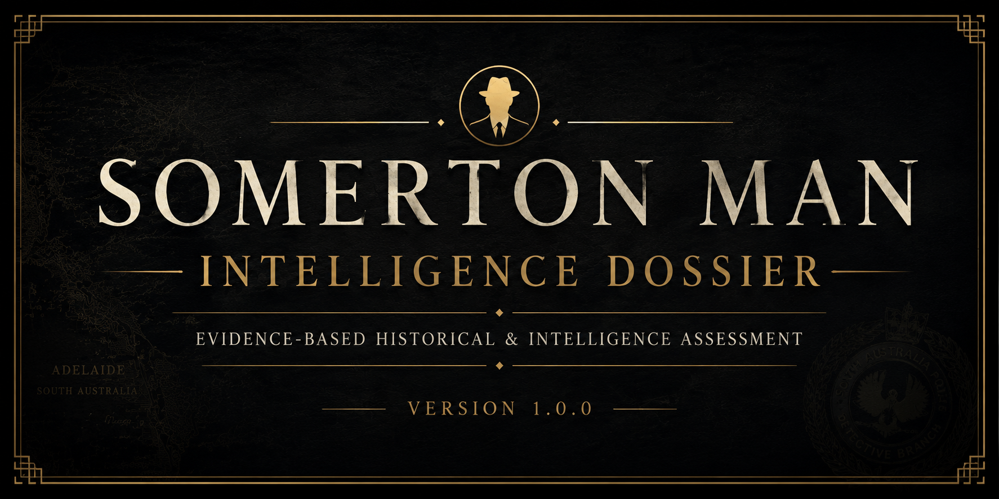

<p align="center">
  
</p>

<h1 align="center">🕵️ Somerton Man Intelligence Dossier</h1>

<p align="center">
<b>An Evidence-Based Historical and Intelligence Assessment of the Somerton Man Case</b>
</p>

<p align="center">

<a href="https://github.com/MohnishShende/somerton-man-intelligence-dossier/releases/latest">

</a>

<a href="https://github.com/MohnishShende/somerton-man-intelligence-dossier/releases/download/v1.0.0/Somerton_Man_Intelligence_Dossier_v1.0.0.pdf">

</a>

<a href="https://github.com/MohnishShende/somerton-man-intelligence-dossier/archive/refs/tags/v1.0.0.zip">

</a>

</p>

<p align="center">

<a href="#-overview">Overview</a> •
<a href="#-downloads">Downloads</a> •
<a href="#-publication-statistics">Statistics</a> •
<a href="#-methodology">Methodology</a> •
<a href="#-repository-structure">Repository</a> •
<a href="#-citation">Citation</a>

</p>

---

# 📖 Overview

The **Somerton Man Intelligence Dossier** is a comprehensive, evidence-based historical and intelligence assessment of one of Australia's most enduring unidentified-person investigations.

Rather than promoting a preferred theory, this project applies structured analytical techniques, forensic reasoning, historical research methods, and intelligence-analysis principles to evaluate the available evidence.

The objective is **not** to declare the case solved.

Instead, this dossier documents:

- ✅ Established facts
- ✅ Supported inferences
- ✅ Competing hypotheses
- ✅ Evidence quality
- ✅ Confidence assessments
- ✅ Outstanding intelligence gaps

Every effort has been made to distinguish evidence from interpretation while maintaining transparency regarding evidentiary limitations.

---

# 📥 Downloads

| Download | Description |
|-----------|-------------|
| 📄 **[Published PDF](https://github.com/MohnishShende/somerton-man-intelligence-dossier/releases/download/v1.0.0/Somerton_Man_Intelligence_Dossier_v1.0.0.pdf)** | Complete 101-page intelligence dossier |
| 🚀 **[Latest Release](https://github.com/MohnishShende/somerton-man-intelligence-dossier/releases/latest)** | Release notes and downloadable assets |
| 📦 **[LaTeX Source (ZIP)](https://github.com/MohnishShende/somerton-man-intelligence-dossier/archive/refs/tags/v1.0.0.zip)** | Complete repository source code |
| 📂 **[Browse Repository](https://github.com/MohnishShende/somerton-man-intelligence-dossier)** | Research database, manuscript, and documentation |

---

# 📊 Publication Statistics

| Metric | Value |
|---------|------:|
| Pages | **101** |
| Words | **28,930** |
| References | **64** |
| Evidence Tables | **51** |
| Historical Claims Reviewed | **75** |
| Competing Hypotheses Evaluated | **6** |
| Appendices | **8** |

---

# 🔬 Methodology

This project follows an evidence-first methodology inspired by professional historical research, forensic investigation, and intelligence analysis.

Methodologies employed include:

- Primary-source verification
- Source reliability assessment
- Evidence confidence analysis
- Analysis of Competing Hypotheses (ACH)
- Structured analytic techniques
- Intelligence requirements development
- Transparent uncertainty reporting
- Reproducible LaTeX publication workflow

No conclusion is presented beyond what the available evidence can reasonably support.

---

# 📂 Repository Structure

```text
assets/             Repository graphics and screenshots
bibliography/       BibLaTeX reference database
documentation/      Project architecture and methodology
evidence/           Primary and secondary source archive
figures/            Images used throughout the dossier
manuscript/         Complete LaTeX manuscript
research/           Structured research database
release/            Versioned publication releases
verification/       Claim verification framework
```

---

# 🎯 Research Principles

The investigation is built upon five guiding principles.

1. Evidence before conclusions.
2. Transparency over certainty.
3. Clear separation of fact, inference, and hypothesis.
4. Explicit confidence assessments.
5. Reproducible research.

Where evidence is insufficient, uncertainty is documented rather than replaced with speculation.

---

# 🧠 Intelligence Framework

The dossier incorporates several structured intelligence methodologies commonly used within the intelligence community and analytical disciplines.

These include:

- Analysis of Competing Hypotheses (ACH)
- Evidence weighting
- Source reliability matrices
- Confidence assessments
- Devil's Advocate Review
- Intelligence requirements
- Indicators and signposts
- Key assumptions analysis

These techniques help minimise confirmation bias while maintaining analytical transparency.

---

# 📚 Citation

Citation metadata is provided in **CITATION.cff**.

If you reference this work, please cite the published release rather than the development repository whenever possible.

---

# 📦 Releases

This project follows **Semantic Versioning**.

| Version | Status |
|----------|--------|
| **v1.0.0** | Initial Public Release |

Future releases may include:

- Newly verified archival material
- Official investigative findings
- Editorial corrections
- Additional forensic evidence
- Methodological improvements

---

# 🤝 Contributing

Constructive contributions are welcome.

Please read the following documents before submitting issues or pull requests.

- CONTRIBUTING.md
- CODE_OF_CONDUCT.md
- SECURITY.md

Corrections should be evidence-based and supported by reliable sources.

---

# ⚖️ License

This repository is licensed under the **GNU General Public License v3.0**.

Please note that certain third-party archival materials referenced or reproduced within the repository may remain subject to separate copyright, licensing, or archival-use restrictions.

---

# 🙏 Acknowledgements

This work draws upon publicly available archival records, historical newspapers, forensic literature, government publications, and the work of numerous historians and researchers who have contributed to understanding the Somerton Man case over many decades.

Their efforts have greatly expanded the historical record available for independent examination.

---

# 📌 Project Status

🟢 **Current Status:** Published

**Latest Release:** Version 1.0.0

This repository functions as a living research archive. Future versions will incorporate verified evidence, official findings, documented corrections, and additional historical material while preserving complete version history.

---

<p align="center">

*"Responsible investigation requires acknowledging uncertainty where evidence remains incomplete."*

</p>
